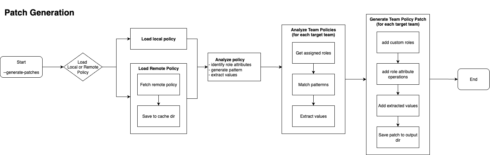

# TeamManager - LaunchDarkly Team Management Tool

TeamManager is a command-line tool that helps you explore and manage your LaunchDarkly teams and their roles. It gives you a clear view of which teams have which roles, how roles are spread out, and where you can make improvements. It comes with handy features for analyzing role-scoped policy and creating or applying patches to update roles more efficiently.


## Features

### **Team Analysis & Reporting**
- **Team Coverage Reports**: Analyze which teams have roles and which don't
- **Role Distribution**: See how roles are distributed across teams
- **Assignment Suggestions**: Get recommendations for optimizing role assignments
- **Export Capabilities**: Generate detailed JSON reports for further analysis

### **Role-scoped Policy Analysis**
- **Role Attribute Discovery**: Analyze roles for `roleAttribute` placeholders
- **Pattern Recognition**: Discover and categorize different attribute patterns
- **Resource Analysis**: Detailed breakdown of role-scoped policy resources
- **Remote Role scoped policy Support**: Fetch roles directly from LaunchDarkly API
- **Missing Attribute Detection**: Identify teams that lack required role attributes

### **Patch Generation & Application**
- **Automated Patch Creation**: Generate patches based on role-scoped policy and actual team roles
- **Remote Template Integration**: Use live custom roles from LaunchDarkly as templates
- **Template Caching**: Automatic local caching of remote role-scoped policy for performance
- **Value Extraction**: Extract role attribute values from existing team roles
- **Batch Processing**: Apply patches to multiple teams simultaneously
- **Smart File Selection**: Automatically uses the latest patch file when multiple exist
- **Attribute Validation**: Validate that teams have all required attributes before patch generation


## Installation

### Prerequisites
- Python 3.7+
- LaunchDarkly API access token

### Setup
1. Clone the repository:
```bash
git clone <repository-url>
cd Automation
```

2. Install dependencies and activate virtual environment
```bash
./setup.sh
source venv/bin/activate
```

3. Set up your LaunchDarkly API key:
```bash
export LAUNCHDARKLY_API_KEY="sdk-your-api-key-here"
```
Or create a `.env` file:
```bash
echo "LAUNCHDARKLY_API_KEY=sdk-your-api-key-here" > .env
```

## Quick Start
> The following commands are ran in `Automation/team_manger` directory. To run from `Automation` directory simply use `team-manager <options>`

### Basic Team Analysis
```bash
# Generate team coverage report
python -m team_manager.main --report
  or
team-manager --report

# List teams without roles
python -m team_manager.main --teams-without-roles
  or
team-manager --teams-without-roles

# Show role distribution/assignment across teams
python -m team_manager.main --role-distribution
  or
team-manager --role-distribution

# Generate  detailed report to file
python -m team_manager.main --export
  or
team-manager --export  
```

### Role-scoped Policy Analysis
```bash
# Analyze a template for roleAttribute patterns
python -m team_manager.main --analyze-template template.json

# Example output shows discovered attributes and patterns
```

### Patch Generation & Application

```bash
# Generate patches for all teams with roles
python -m team_manager.main --generate-patches role-scoped-policy.json

# Generate patches for specific teams
python -m team_manager.main --generate-patches role-scoped-policy.json --teams team-1 team-2

# Generate patches using remote template (custom role from LaunchDarkly)
python -m team_manager.main --generate-patches my-role-key --remote-template

# Generate patches for specific teams using remote template
python -m team_manager.main --generate-patches my-role-key --remote-template --teams team-1 team-2

# Apply patches to teams
python -m team_manager.main --apply-patches team-1 team-2

# Apply with custom options
python -m team_manager.main --apply-patches team-1 \
    --patch-dir custom/patches \
    --comment "Role attribute update"
```

## Understanding Role Attributes and Missing Attributes

### **What are Role Attributes?**

Role attributes are dynamic placeholders in LaunchDarkly custom role templates that allow for personalized role assignments. They use the syntax `${roleAttribute/attribute_name}` and are typically found in resource paths.

**Common Examples:**
- `${roleAttribute/department}` - Department-specific access (e.g., "engineering", "marketing")
- `${roleAttribute/project}` - Project-specific permissions (e.g., "web-app", "mobile-api")
- `${roleAttribute/environment}` - Environment-specific access (e.g., "staging", "production")
- `${roleAttribute/region}` - Regional access control (e.g., "us-east", "eu-west")

**Example Template Resource:**
```json
{
  "resources": [
    "proj/${roleAttribute/project}:env/production:flag/*:rollout",
    "proj/${roleAttribute/project}:env/${roleAttribute/environment}:segment/*"
  ]
}
```

### **How TeamManager Handles Role Attributes**

1. **Template Analysis**: Discovers all `roleAttribute` patterns in template files
2. **Value Extraction**: Extracts actual values from existing team roles that match the patterns
3. **Patch Generation**: Uses extracted values to create personalized role assignments
4. **Validation**: Identifies teams missing required attributes

### **Missing Attributes Detection**

When generating patches, TeamManager checks if each team has existing roles that contain the required attributes. If a team lacks a specific attribute, it's flagged as "missing."

**Example Output:**
```bash
Generated Patches:
  • dev-team-1: dev-team-1_20241201_143022_patch.json
    Roles: engineering-role, qa-role
    Attributes: project, environment
      project: ['web-app', 'mobile-api']
      environment: ['staging', 'production']

  • marketing-team: marketing-team_20241201_143025_patch.json
    Roles: content-role
    Attributes: department
    ⚠️ Missing attributes for [marketing-team]: project, environment
      
```

### **What Missing Attributes Mean**

**⚠️ Warning Indicators:**
- Teams showing missing attributes can still receive patches
- Missing attributes will result in incomplete role assignments
- These teams may need manual attribute configuration

**Common Causes:**
1. **New Teams**: Recently created teams without established role patterns
2. **Role Evolution**: Templates requiring new attributes not yet in existing roles
3. **Incomplete Role Coverage**: Teams with limited role assignments

### **Resolving Missing Attributes**

**Option 1: Manual Role Assignment**
```bash
# Assign roles with required attributes to teams before patch generation
# This allows TeamManager to extract the needed values
```

**Option 2: Custom Patch Modification**
```bash
# Edit generated patch files to add missing attribute values
# Useful for one-time assignments or special cases
```

**Option 3: Template Adjustment**
```bash
# Modify templates to use existing attributes or make attributes optional
# Appropriate when attribute requirements change
```

### **Best Practices for Role Attributes**

1. **Consistent Naming**: Use standardized attribute names across templates
2. **Documentation**: Document required attributes in template files
3. **Gradual Rollout**: Add new attributes to existing teams before template deployment
4. **Validation**: Always check for missing attributes before applying patches
5. **Backup Strategy**: Create backups before bulk attribute assignments

## Usage

### Command Line Options

#### **Main Operations**
- `--report`, `-r`: Generate and display team coverage report
- `--export`, `-e`: Export comprehensive team report to JSON file
- `--teams-without-roles`, `-twor`: List teams with no custom roles
- `--teams-with-roles`, `-twr`: List teams with custom roles assigned
- `--role-distribution`, `-rd`: Show role distribution statistics
- `--suggestions`, `-s`: Get role assignment suggestions

#### **Template & Patch Operations**
- `--analyze-template TEMPLATE_FILE`, `-at`: Analyze template for roleAttribute patterns
- `--generate-patches TEMPLATE_FILE_OR_ROLE_KEY`, `-gp`: Generate patch files for teams
- `--remote-template`, `-rt`: Fetch template remotely by role key instead of using local file
- `--template-cache-dir`: Directory to cache remote templates (default: `output/template`)
- `--apply-patches TEAM_KEY [TEAM_KEY ...]`, `-ap`: Apply patches to specified teams
- `--teams TEAM_KEY [TEAM_KEY ...]`, `-t`: Specify teams to process

#### **Configuration Options**
- `--no-cache`: Force fresh data fetch from API (ignore cache)
- `--output-dir`: Directory for report files (default: `output/reports`)
- `--patch-output-dir`: Directory for patch files (default: `output/patches`)
- `--patch-dir`: Directory containing patch files for application (default: `output/patches`)
- `--comment`: Comment for patch operations (default: "Applied patch via TeamManager")

#### **Logging Options**
- `--debug`: Enable debug logging
- `--log-file`: Write logs to specified file

### Examples

#### **1. Basic Team Analysis**
```bash
# Quick coverage overview
python -m team_manager.main --report

# Export detailed analysis
python -m team_manager.main --export --output-dir reports/
```

#### **2. Template Analysis Workflow**
```bash
# Analyze template structure
python -m team_manager.main --analyze-template developer-template.json

# Generate patches based on template
python -m team_manager.main --generate-patches developer-template.json

# Apply to specific teams
python -m team_manager.main --apply-patches dev-team-1 dev-team-2
```

#### **3. Remote Template Operations**
```bash
# Generate patches using remote template
python -m team_manager.main --generate-patches developer-role --remote-template

# Remote template for specific teams with custom cache directory
python -m team_manager.main --generate-patches admin-role --remote-template \
    --teams team-a team-b --template-cache-dir custom/templates

# Apply generated patches
python -m team_manager.main --apply-patches team-a team-b
```

#### **4. Bulk Operations**
```bash
# Generate patches for all teams with roles
python -m team_manager.main --generate-patches template.json

# Apply patches to multiple teams with custom comment
python -m team_manager.main --apply-patches team-1 team-2 team-3 \
    --comment "Quarterly role attribute update"
```

## Architecture

#### **File Structure**
```
team_manager/
├── __init__.py          # Package initialization
├── team_manager.py       # Main TeamManager class and RoleAttributeExtractor
├── main.py             # CLI interface and argument parsing
└── README.md           # This documentation
```

### Dependencies
- **LaunchDarkly API Client**: For API interactions
- **Policy Linter**: For policy validation and analysis

## Output Files

### **Reports** (`output/reports/`)
```json
{
  "coverage_report": {
    "summary": {
      "total_teams": 25,
      "teams_with_roles": 18,
      "team_coverage_percentage": 72.0
    },
    "teams_without_roles": [...],
    "teams_with_roles": [...]
  },
  "role_distribution": {...},
  "suggestions": {...}
}
```

### **Patch Files** (`output/patches/`)
```json
{
  "team_key": "dev-team-1",
  "template_source": "template.json",
  "type": "team_roleAttribute_patch",
  "created_at": "2025-01-18T10:30:00",
  "roles_analyzed": ["developer-role"],
  "extracted_values": {
    "projectKey": ["project-alpha", "project-beta"],
    "environmentKey": ["development", "staging"]
  },
  "instructions": [
    {
      "kind": "addCustomRoles",
      "values": ["template-role"]
    },
    {
      "kind": "addRoleAttribute",
      "key": "projectKey",
      "values": ["project-alpha", "project-beta"]
    }
  ]
}
```

## Advanced Features

### **Remote Template Support**
TeamManager can fetch custom role definitions directly from LaunchDarkly API to use as templates:

- **Always Current**: Uses the latest role definition from LaunchDarkly
- **No Manual Export**: Eliminates need to manually download and maintain template files
- **Automatic Caching**: Remote templates are cached locally for performance
- **Cache Directory**: Configurable cache location (default: `output/template/`)

#### **How Remote Templates Work**
1. **Fetch**: TeamManager retrieves the custom role from LaunchDarkly API
2. **Cache**: The role definition is saved with timestamp in the cache directory
3. **Process**: The cached template is used for patch generation
4. **Reuse**: Subsequent runs can use cached version (subject to cache TTL)

#### **Remote Template Examples**
```bash
# Basic remote template usage
python -m team_manager.main --generate-patches my-role-key --remote-template

# With specific teams and custom cache
python -m team_manager.main --generate-patches developer-role --remote-template \
    --teams dev-team-1 dev-team-2 --template-cache-dir /path/to/templates

# View generated template cache
ls output/template/
# developer-role_20250118_143426.json
# admin-role_20250118_150312.json
```
### **Multiple Patch File Handling**    
When multiple patch files exist for the same team, TeamManager automatically:
- Discovers all available patch files
- Selects the most recent one (based on timestamp)
- Logs detailed selection information

### **Template Pattern Discovery**
The system can discover complex roleAttribute patterns including:
- Simple attribute replacement: `proj/${roleAttribute/projectKey}`
- Multi-attribute resources: `proj/${roleAttribute/projectKey}:env/${roleAttribute/environmentKey}`
- Complex patterns: `proj/${roleAttribute/projectKey}:env/${roleAttribute/environmentKey}:experiment/a-test`

### **Smart Value Extraction**
Values are extracted from existing roles with:
- Pattern matching against discovered templates
- Wildcard filtering (excludes `*` values)
- Placeholder filtering (excludes `${}` values)
- Deduplication and sorting

## Example Workflows

### **1. Initial Team Assessment**
```bash
# Step 1: Analyze current state
python -m team_manager.main --report

# Step 2: Identify optimization opportunities  
python -m team_manager.main --suggestions

# Step 3: Export for stakeholder review
python -m team_manager.main --export
```

### **2. Template-Based Role Updates**
```bash
# Option A: Using Local Template
# Step 1: Analyze template structure
python -m team_manager.main --analyze-template new-template.json

# Step 2: Generate patches for target teams
python -m team_manager.main --generate-patches new-template.json --teams team-a team-b

# Option B: Using Remote Template
# Step 1: Generate patches using remote role as template
python -m team_manager.main --generate-patches standard-developer --remote-template --teams team-a team-b

# Step 3: Review generated patches (manual step)
ls output/patches/

# Step 4: Apply patches
python -m team_manager.main --apply-patches team-a team-b --comment "Template migration Q1 2025"
```

### **3. Bulk Role Attribute Updates**
```bash
# Generate patches for all teams
python -m team_manager.main --generate-patches global-template.json

# Review and apply in batches
python -m team_manager.main --apply-patches $(cat teams-batch-1.txt) --debug

# Monitor results and iterate
python -m team_manager.main --report
```

## Troubleshooting

### **Common Issues**

#### **No Patch Files Found**
```bash
Error: No patch files found for teams: [team-1, team-2]
```
**Solution**: Generate patches first using `--generate-patches`

#### **API Authorization Errors**
```bash
Error: Authorization error: Invalid API key
```
**Solution**: Verify your `LAUNCHDARKLY_API_KEY` is set correctly

#### **Template Analysis Shows No Patterns**
```bash
No roleAttribute patterns found in template.
```
**Solution**: Ensure template contains `${roleAttribute/key}` placeholders

#### **Remote Template Fetch Errors**
```bash
Error: Unable to fetch remote template 'role-key': [API Error]
```
**Solutions**: 
- Verify the role key exists in LaunchDarkly
- Check API key permissions
- Ensure network connectivity

#### **Role Attribute Already Exists Error**
```bash
Failed Patch Applications:
  • s-team-2: cannot add role attribute: role attribute key 'projectKey' already exists
    Patch File: s-team-2_20250728_124047_patch.json
```

**What this means**: The team already has a role attribute with the specified key defined. TeamManager cannot overwrite existing role attributes for safety reasons.

**Solutions**:

**Option 1: Check Current Attributes**
```bash
# View team's current role attributes
python -m team_manager.main --report
# Look for the team and check its "Role Attributes" section
```

**Option 2: Manual Attribute Management**
- Remove the existing attribute in LaunchDarkly UI if it needs to be replaced
- Update the existing attribute value directly in LaunchDarkly if modification is needed
- Use a different attribute key in your template if this is a naming conflict

**Option 3: Skip Conflicting Teams**
```bash
# Apply patches only to teams without conflicts
python -m team_manager.main --apply-patches team-1 team-3 team-4
# Exclude teams that show attribute conflicts
```

**Prevention**: Always check existing team role attributes before generating patches for teams that already have established role configurations.

### **Debug Mode**
Use `--debug` flag for detailed logging:
```bash
python -m team_manager.main --apply-patches team-1 --debug
```
