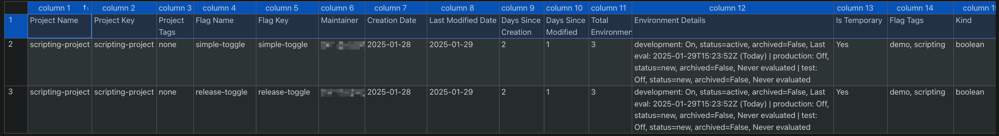
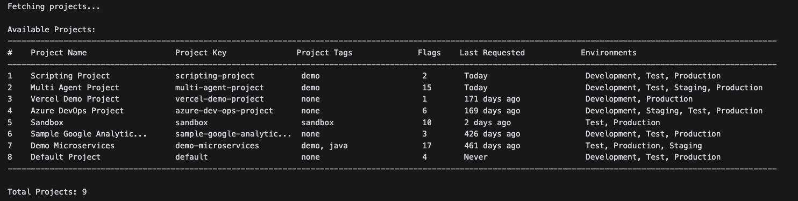

# LaunchDarkly Feature Flag Cleanup Report Generator

A tool that complements LaunchDarkly's [Launch Insights](https://docs.launchdarkly.com/home/getting-started/launch-insights) by providing bulk analysis and offline reporting capabilities, this tool focuses on:

- Offline batch processing and reporting
- Multi-project analysis and comparison
- Automated CSV exports for data processing
- Cached data for faster repeated analysis

### Recommended Workflow

1. Use **Launch Insights** for:
   - Interactive flag analysis
   - Custom date range visualization
   - Real-time monitoring
   - Individual flag deep-dives
   - Team collaboration

2. Use this **Cleanup Report Tool** for:
   - Bulk cleanup initiatives
   - Multi-project comparisons
   - Automated reporting
   - Offline analysis
   - Data exports for custom processing

## Features

- Interactive project selection mode
- List and filter projects by tags
- Track flag evaluation metrics across environments
- Detailed CSV reports for flag analysis


## Reports
### CSV Report

The CSV report provides a comprehensive analysis of your feature flags, helping identify cleanup opportunities and track flag usage patterns.

It offers two views:

1. Organization View:  Using `--all-projects` :
    - Project details (name, key, tags)
    - Flag details (name, key, maintainer)
    - Creation and modification dates
    - Environment status and last evaluation dates
    - Flag metadata (temporary status, tags, kind)

2. Project View: Using `--project_key (-p)`:
    - Flag evaluation metrics per environment
    - 7, 14, 30, 60 day total evaluation count
    - includes everything in organization view


### Console Report

The console report is generated using the `--list-projects` command and displays data in an easy-to-read table format, making it simple to scan multiple projects at once.
This report helps identify:
- Inactive projects with no recent flag evaluations
- Projects with a high number of flags that may need cleanup
- Project tag organization and coverage
- Environment configuration across projects

The console report provides a quick overview of all LaunchDarkly projects with key metrics:

- Project name and key
- Project tags
- Number of feature flags
- Days since last flag evaluation
- Environment names


## Prerequisites

Before using this tool, you need to create a LaunchDarkly API access token with read-only permissions:

1. Create an access token by following the instructions at [Creating API Access Tokens](https://docs.launchdarkly.com/home/account/api-create)

2. For permissions, you can either:
   - Use the built-in "Reader" role (recommended for most users)
   - Create a custom role with restricted project access (see [Scoping API Tokens](https://docs.launchdarkly.com/home/account/api/?q=reader+access+token#scope-personal-api-access-tokens))

> **Important**: Store your access token securely. It cannot be viewed again after creation.

## Quick Start

1. Clone and setup:
```bash
git clone <repository-url>
cd ld-cleanup-report
chmod +x setup.sh
./setup.sh
```

2. Set your LaunchDarkly API Access Token:
```bash
# Option 1: Export as environment variable
export LAUNCHDARKLY_API_KEY='your-api-key-here'

# Option 2: Create .env file
cp .env.example .env
# Edit .env and add your API key
```
3. Activate your virtual environment:
```bash
source venv/bin/activate
```

3. Run in interactive mode:
```bash
ld-cleanup-report
```
or run in command line mode:
```bash
ld-cleanup-report --all-projects --output flag_cleanup_report.csv
``` 

4. Deactivate your virtual environment:
```bash
deactivate
```

## Generating Evaluation Metrics

To generate evaluation metrics for a single project, use the `--project_key` option:
```bash
# this will create a cache of the project and its flags evaluation metrics
ld-cleanup-report --project_key demo-project 
``` 
> Note: To improve performance, evaluation metrics are not included in multi-project reports.


## Usage

### Interactive Mode (Default)
When run without arguments, the tool operates in interactive mode:
```bash
ld-cleanup-report
```

Interactive mode will:
1. Display a list of all available projects with:
   - Project name and key
   - Project tags
   - Number of flags
   - Days since last flag evaluation
   - Environment names
2. Prompt for project selection:
   - Enter a number to select a specific project
   - Enter 'a' to analyze all projects
   - Enter 'q' to quit

### Command Line Options

| Option | Description | Default |
|--------|-------------|---------|
| `--force-refresh` | Ignore cache and fetch fresh data | False |
| `--output`, `-o` | Path for the output CSV file | flag_cleanup_report.csv |
| `--cache-ttl` | Cache lifetime in hours | 24 |
| `--cache-dir` | Directory to store cache files | cache |
| `--project_key`, `-p` | Specific project to analyze (includes evaluation metrics) | None |
| `--tag`, `-t` | Filter by project tag(s). Can be specified multiple times | None |
| `--list-projects` | List available projects | False |
| `--list-tags` | List available project tags | False |
| `--all-projects` | Analyze all projects | False |

> Must include either `--all-projects`, `--list-projects` or `--project_key` for command line mode.

### Project Tag Filtering

The `--tag` option can be used to filter projects in several ways:

1. With `--all-projects`:
   ```bash
   # Generate report for all projects with the 'production' tag
   ld-cleanup-report --all-projects --tag production

   # Generate report for projects with either 'production' OR 'critical' tags
   ld-cleanup-report --all-projects --tag production --tag critical
   ```

2. With `--list-projects`:
   ```bash
   # List only projects with specific tag
   ld-cleanup-report --list-projects --tag demo

   # List projects with either tag (OR condition)
   ld-cleanup-report --list-projects --tag demo --tag managed-by-terraform
   ```

When using multiple tags, they are treated as an OR condition - projects that have any of the specified tags will be included in the report or listing.

> Note: Tag filtering is applied whether using cached data or fetching fresh data with `--force-refresh`

### Flag Evaluation Metrics

When analyzing a single project using `--project_key` or `-p`, the report includes evaluation metrics for recent time periods:

| Time Period | Description | Metric Name|
|-------------|-------------|-------------|
| Last 60 days | Shows long-term usage patterns | 60_day_evals |
| Last 30 days | Aligns with monthly review cycles | 30_day_evals |
| Last 14 days | Helps identify bi-weekly trends | 14_day_evals |
| Last 7 days | Shows very recent activity | 7_day_evals |


These metrics help identify flag usage, below are example patterns:
| Pattern | Time Period | Evaluations | Trend | Notes |
|---------|-------------|-------------|-------|--------|
| **Growing Usage** | 60 days | 1000 | +20% per period | Steady base of usage |
| | 30 days | 800 | +30% per period | Increased monthly activity |
| | 14 days | 500 | +40% per period | Recent growth |
| | 7 days | 300 | +50% per period | Very active currently |
| **Stable Usage** | 60 days | 1000 | ±5% variation | Consistent long-term usage |
| | 30 days | 500 | ±5% variation | Expected monthly rate |
| | 14 days | 250 | ±5% variation | Normal bi-weekly activity |
| | 7 days | 125 | ±5% variation | Typical weekly usage |
| **Declining Usage** | 60 days | 1000 | -40% per period | Historical usage |
| | 30 days | 200 | -50% per period | Significant drop |
| | 14 days | 50 | -60% per period | Very low recent usage |
| | 7 days | 10 | -70% per period | Minimal current activity |
| **Abandoned Flag** | 60 days | 100 | -100% drop | Some historical usage |
| | 30 days | 0 | No activity | No recent usage |
| | 14 days | 0 | No activity | No activity |
| | 7 days | 0 | No activity | Completely inactive |


> Note: These metrics are not included in multi-project reports to maintain performance.

#### Examples
```bash
# Generate report with evaluation metrics for specific project
ld-cleanup-report --project_key demo-project

# List projects with specific tag
ld-cleanup-report --list-projects --tag demo

# Filter by multiple tags (OR condition)
ld-cleanup-report --tag demo --tag java --all-projects

# List projects with either tag
ld-cleanup-report --list-projects --tag demo --tag managed-by-terraform
```

## Cache Management


The cache directory (default: `cache/`) contains
```
cache/
  ├── ldc_cache_data.json           # Main project data cache
  ├── ldc_cache_eval_proj1.json     # Evaluation metrics for project 1
  ├── ldc_cache_eval_proj2.json     # Evaluation metrics for project 2
  └── ...
```

All cache files:
- Use the `ldc_cache_` prefix
- End with `.json` extension
- Are automatically managed by the tool
- Can be cleared using `--force-refresh`

The tool maintains two types of caches to reduce API calls:
1. Project Data Cache (`ldc_cache_data.json`):
   - Contains project, environment, and flag data
   - Shared across all operations
   - TTL configurable with `--cache-ttl`

2. Evaluation Metrics Cache (`ldc_cache_eval_<project_key>.json`):
   - Created per project when using `--project_key`
   - Contains flag evaluation metrics for 7/14/30/60 days
   - Uses same TTL as project data cache
   - Automatically created and updated

### Cache TTL Configuration
```bash
# Use default 24-hour TTL for all caches
ld-cleanup-report

# Set custom TTL (in hours)
ld-cleanup-report --cache-ttl 48

# Force refresh all caches
ld-cleanup-report --force-refresh

# Force refresh specific project's evaluation cache
ld-cleanup-report --project_key demo-project --force-refresh
```

### Cache Invalidation
Caches are refreshed when:
- Cache age exceeds TTL
- TTL value changes
- `--force-refresh` is used
- Cache file is missing/corrupted

### Project Data Cache Schema
The main cache file (`ldc_cache_data.json`) uses the following schema:
```json
{
    "fetch_date": "2024-03-14T15:30:00.000Z",  // ISO timestamp of last fetch
    "cache_ttl": 24,                           // Cache TTL in hours
    "projects": [                              // Array of project data
        {
            "key": "string",                   // Project identifier
            "name": "string",                  // Project name
            "tags": ["string"],                // Project tags
            "environments": [                  // Array of environments
                {
                    "key": "string",           // Environment identifier
                    "name": "string",          // Environment name
                    "color": "string",         // Environment color code
                }
            ],
            "flags": [                        // Array of feature flags
                {
                    "key": "string",          // Flag identifier
                    "name": "string",         // Flag name
                    "kind": "string",         // Flag type (boolean, multivariate)
                    "temporary": boolean,     // Whether flag is temporary
                    "tags": ["string"],       // Flag tags
                    "maintainerId": "string", // Flag maintainer
                    "environments": {         // Environment-specific flag data
                        "env_key": {
                            "on": boolean,    // Flag state
                            "archived": boolean, // Archive status
                            "lastRequested": "string" // Last evaluation timestamp
                        }
                    }
                }
            ]
        }
    ]
}
```

### Evaluation Metrics Cache Schema
The evaluation cache files (`ldc_cache_eval_<project_key>.json`) use the following schema:
```json
{
    "fetch_date": "2024-03-14T15:30:00.000Z",  // ISO timestamp of last fetch
    "cache_ttl": 24,                           // Cache TTL in hours
    "evaluations": {                           // Map of evaluation metrics
        "env_key:flag_key:days": int           // Total evaluations for time period
    }
}
```

Each evaluation cache file:
- Is specific to a single project
- Stores metrics for all flags in that project
- Uses the same TTL as the main cache
- Is automatically created when using `--project_key`
- Is stored in the configured cache directory (default: `cache/`)

The cache key format (`env_key:flag_key:days`):
- Combines environment key, flag key, and time period
- Allows efficient lookup of metrics


## Contributing & License
We welcome contributions! Please feel free to submit a PR or open an issue to suggest improvements or new features.
This project is licensed under the MIT License. See the LICENSE file for details.
