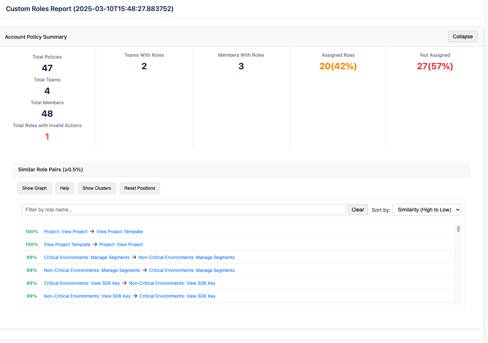
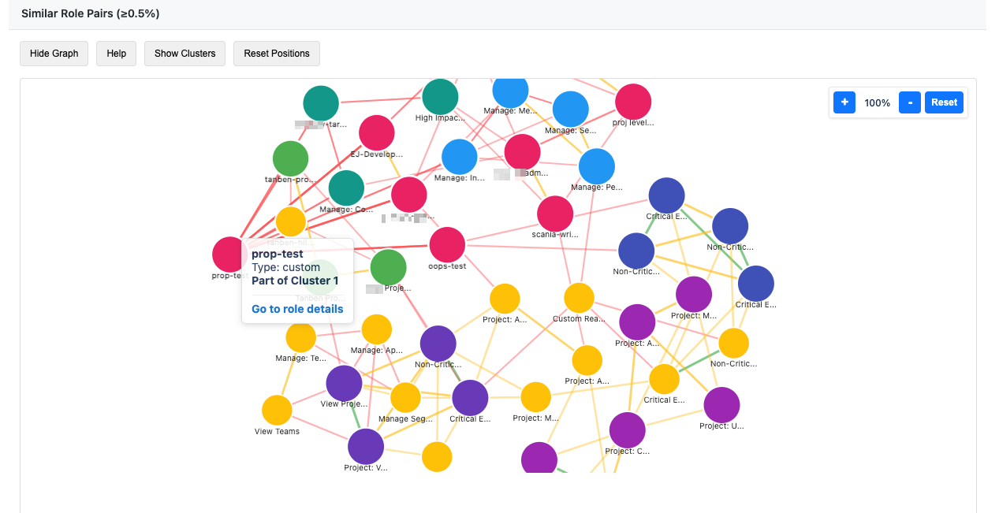
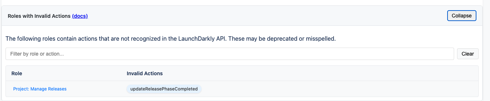
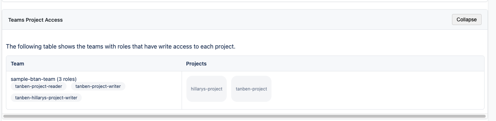
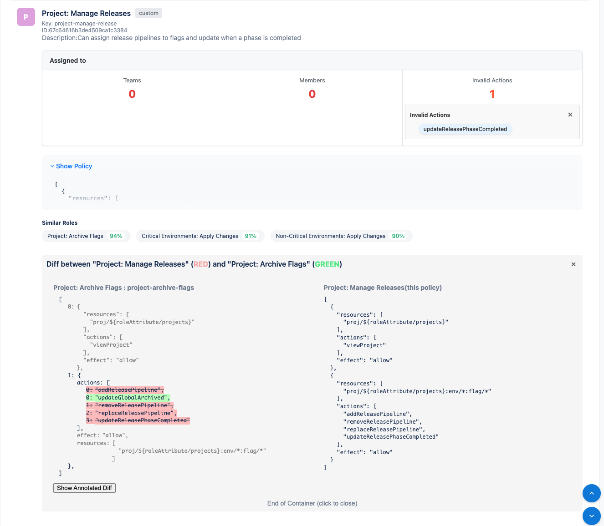

# LaunchDarkly Policy Report Generator

A tool for analyzing LaunchDarkly custom role policies to identify similarities, track role assignments, and visualize team access patterns. 

## Features

### Policy Analysis
- **Similarity Detection**: Identifies similar policies using semantic analysis
- **Side-by-Side Comparison**: Visual comparison of policy statements
- **Annotated Diffs**: Highlights differences between similar policies
- **Similarity Scoring**: Quantifies policy similarity with color-coded indicators
- **Action Validation**: Validates policy actions against official LaunchDarkly resource actions

### Role Management
- **Assignment Tracking**: Shows which teams and members are assigned to each role
- **Unassigned Role Detection**: Identifies roles not assigned to any team or member
- **Role Type Classification**: Categorizes roles (admin, writer, reader, custom)
- **Role Statistics**: Provides metrics on role usage and distribution
- **Invalid Action Detection**: Identifies deprecated, misspelled, or custom actions in policies

### Team Access Visualization
- **Teams Project Access Table**: Interactive view of which teams have access to which projects
- **Role Assignment Indicators**: Shows how many roles are assigned to each team
- **Scrollable Interface**: Fixed-height table with sticky headers for easy navigation
- **Toggle Display**: Collapsible view to focus on relevant information


## Report Structure

The report is generated in the `./reports` directory by default. After running this script, open the `policy_report.html` file in `./reports` directory to view the interactive report.

### Summary Section
- Account-wide statistics on roles, teams, and members
- Distribution of role assignments
- Quick access to Teams Project Access table
- Clusters view showing strongly connected components
- Graph nodes represent roles, edges represent similarity relationships



### Invalid Actions Section
- List of roles containing invalid actions
- Details of which actions are invalid for each role
- Links to the corresponding role cards
- Search functionality to filter by role or action



### Teams Project Access
- Scrollable table showing team-project relationships
- Role assignment indicators for each team
- Project access distribution across teams


### Role Cards
Each role is represented by a card showing:
- Role name and key
- Role type indicator (admin, writer, reader, custom)
- Assignment statistics (teams and members)
- Similar roles with similarity scores
- Policy preview with expand/collapse functionality



## Installation

### Prerequisites

- Python 3.7 or higher
- pip (Python package installer)
- Internet connection for downloading dependencies
- LaunchDarkly account with API access
#### Downloading Alternative Models
The tool includes a utility script for downloading transformer models from Hugging Face:
For example
```bash
% python ./src/download_transformer.py --model sentence_transformers/all-MiniLM-L6-v2 --output-path ./my-models
```
or download `all-mpnet-base-v2` (more accurate, larger) transformer
```
 % python3 src/download_transformer.py --model all-mpnet-base-v2 --output-path sentence_transformers/all-mpnet-base-v2
```
and use
```
% ld-policy-report --model-path sentence_transformers/all-mpnet-base-v2 --min-similarity 0.9 
```

Options:
- `--model`: Model to download (default: all-MiniLM-L6-v2) 
- `--output-path`: Path where the model should be downloaded (required)
- `--debug`: Enable debug logging
To use a different local transformer model:
```bash
% ld-policy-report --model-path ./my-models/all-MiniLM-L6-v2
```

### Using pip

The simplest way to install the package is via pip:

```bash
% pip install launchdarkly-policy-report
```

This will install the package and all its dependencies globally.

### Development Installation

For development or local installation, you can use the provided setup script:

```bash
# Clone the repository
git clone <this repo> 
cd ld-policy-report

# Make the script executable
chmod +x setup.sh

# Run the setup script
./setup.sh
```

The setup script will:
1. Create a virtual environment in the `venv` directory
2. Install the package in development mode
3. Install all required dependencies
4. Set up the necessary directories

### Activating/Deactivating Local Environment

After running the setup script, activate the virtual environment:

```bash
% source venv/bin/activate
```

To deactivate when finished:

```bash
% deactivate
```

## Configuration

### API Key Setup

1. Copy the `.env.example` to `.env`
2. Set the `LAUNCHDARKLY_API_KEY` with a READ only access token

```bash
LAUNCHDARKLY_API_KEY=api-xxxx
```

You can obtain an API key from your LaunchDarkly account:
1. Go to Account settings > Authorization
2. Create a new API token with read access
3. Copy the token and paste it in your `.env` file

### Directory Structure

The tool creates several directories for its operation:
- `cache/`: Stores cached API responses
- `embeddings/`: Stores persistent embeddings
- `reports/`: Stores generated reports

These directories are created automatically if they don't exist.

## Usage

Run the policy report generator:

```bash
% ld-policy-report [options]
```

### Command Line Options

```
Optional arguments:
  --force-refresh         Force refresh of cached data and re-embed policies
  --policies-output FILE  Output file for policy similarities (default: ./reports/policies.json)
  --report-output FILE    Output file for policy report (default: ./reports/policy_report.html)
  --cache-ttl HOURS       Cache time-to-live in hours (default: 24)
  --cache-dir DIR         Directory to store cache files (default: cache)
  --persist BOOL          Use persistent storage for embeddings (default: True)
  --embeddings DIR        Path to store persistent embeddings (default: ./embeddings)
  --collection NAME       Name of the ChromaDB collection (default: launchdarkly_policies)
  --model-path PATH      Path to local transformer model (default: ./sentence_transformers/all-MiniLM-L6-v2)
  --min-similarity FLOAT  Minimum similarity threshold (default: 0.5)
  --max-results INT       Maximum number of similar policies to return (default: 3)
  --validate-actions      Validate policy actions against official LaunchDarkly resource actions
  --resource-actions-file FILE  Path to JSON file containing LaunchDarkly resource actions
  --invalid-actions-output FILE Output file for invalid actions (default: ./reports/invalid_actions.json)
  --query-file FILE       Path to JSON file containing query parameters
  --debug                 Enable debug logging
```

### Examples

Run generator using cached local data:
```bash
% ld-policy-report
```

Use a different local transformer model:
```bash
% ld-policy-report --model-path ./my-models/all-MiniLM-L6-v2
```
Force refresh local cache and run:
```bash
% ld-policy-report --force-refresh
```

Return 5 similar policies with a higher similarity threshold:
```bash
% ld-policy-report --max-results 5 --min-similarity 0.7

```

Validate policy actions against official LaunchDarkly resource actions:
```bash
% ld-policy-report --validate-actions
```

Validate policy actions using a custom resource actions file:
```bash
% ld-policy-report --validate-actions --resource-actions-file ./custom_resource_actions.json
```

Run with parameters from a query file:
```bash
% ld-policy-report --query-file ./sample_query.json
```

Specify custom output locations:
```bash
% ld-policy-report --report-output ./my-reports/policy-report.html --policies-output ./my-reports/policies.json
```

Use a shorter cache TTL for more frequent updates:
```bash
% ld-policy-report --cache-ttl 6
```

Run with debug logging for troubleshooting:
```bash
% ld-policy-report --debug
```

### Using Query Files

You can use a JSON file to be used to look up policies in the collection.
A query file is a standard LaunchDarkly policy

Example `example_query_file.json`:

```json
[
    {
      "notResources": [
        "proj/sample-project"
      ],
      "actions": [
        "viewProject"
      ],
      "effect": "allow"
    }

  ]
```

To use this query file:

```bash
% ld-policy-report --query-file ./example_query_file.json
```


## Resource Actions JSON Schema

The resource actions JSON file used for policy validation should follow this schema:

```json
{
  "$schema": "http://json-schema.org/draft-07/schema#",
  "type": "object",
  "description": "LaunchDarkly resource actions mapping",
  "additionalProperties": {
    "type": "array",
    "items": {
      "type": "string"
    },
    "description": "List of valid actions for a specific resource type"
  },
  "propertyNames": {
    "type": "string",
    "description": "Resource type (e.g., 'acct', 'proj/*', 'team/*')"
  }
}
```

Example resource actions JSON file:

```json
{
  "acct": [
    "createAnnouncement",
    "deleteAnnouncement",
    "updateAnnouncement"
  ],
  "proj/*": [
    "createProject",
    "deleteProject",
    "updateProjectName",
    "viewProject"
  ],
  "team/*": [
    "createTeam",
    "deleteTeam",
    "viewTeam"
  ]
}
```

Each key in the JSON object represents a resource type, and its value is an array of valid actions for that resource type. The policy validator will check each action in each policy statement against this list to identify invalid actions. See file `example_resource_actions.json`


## Technical Details

### Embedding Generation
The tool uses sentence transformers to convert policy statements into vector embeddings:
- Default model: Bundled `all-MiniLM-L6-v2` (faster, smaller)
- Alternative models:
  - `all-mpnet-base-v2` (more accurate, larger)
  - Download using utility `download_transformer.py` and use custom local models via `--model-path`

The embedding process:
1. Converts JSON policy statements to human-readable text
2. Generates vector embeddings using the selected model
3. Stores embeddings in ChromaDB for efficient similarity search

### Policy Validation
The tool validates policy actions against official LaunchDarkly resource actions:
1. Loads resource actions from a built-in dictionary or a custom JSON file
2. Checks each action in each policy statement against the valid actions list
3. Identifies invalid actions (deprecated, misspelled, or custom)
4. Includes invalid actions in the HTML report for easy identification

### Cache Management
The tool caches API responses to minimize requests to the LaunchDarkly API:
- Cache is stored in the specified cache directory
- TTL controls how long cached data is considered valid
- Force refresh option available to bypass cache

Cache structure:
- `ldc_cache_data.json`: Main cache file with all API responses
- Individual cache files for specific API endpoints

### Persistent Storage
Embeddings can be stored persistently using ChromaDB:
- Speeds up subsequent runs by reusing embeddings
- Can be disabled with `--persist False` for one-time analysis
- Stored in the specified embeddings directory

### Performance Considerations
- First run will be slower due to embedding generation
- Subsequent runs use cached data and embeddings for faster performance
- Large LaunchDarkly accounts with many roles may require more memory
- The `all-mpnet-base-v2` model provides more accurate results but requires more resources

## Environment Variables
- `LAUNCHDARKLY_API_KEY`: API key for LaunchDarkly (required)
- `LD_API_KEY`: Alternative to providing API key via command line
- `PYTEST_API_KEY`: API key for integration tests

## Dependencies
- `requests`: For API communication
- `tqdm`: For progress bars
- `sentence-transformers`: For embedding generation
- `chromadb`: For vector storage and similarity search
- `python-dotenv`: For environment variable loading

## Troubleshooting

### Common Issues

1. **API Key Issues**
   - Ensure your API key has read access to custom roles
   - Check that the key is correctly formatted in the .env file

2. **Cache Problems**
   - If you encounter stale data, use `--force-refresh`
   - Delete the cache directory to start fresh

3. **Memory Errors**
   - For large accounts, try using the smaller embedding model
   - Reduce `--max-results` to process fewer similar policies

4. **Report Not Generating**
   - Check permissions on the reports directory
   - Ensure you have write access to the specified output location

5. **Invalid Actions**
   - If you're seeing unexpected invalid actions, check your resource actions file
   - Make sure the JSON format matches the expected schema
   - Use the built-in resource actions by omitting the `--resource-actions-file` option

6. **Query File Issues**
   - Ensure your query file is valid JSON
   - Check that parameter names match the expected format (snake_case)
   - Verify file paths are correct and accessible

### Getting Help

If you encounter issues not covered here:
1. Enable debug logging with `--debug`
2. Check the console output for error messages
3. File an issue on the GitHub repository with the error details

## License
Apache 2.0
